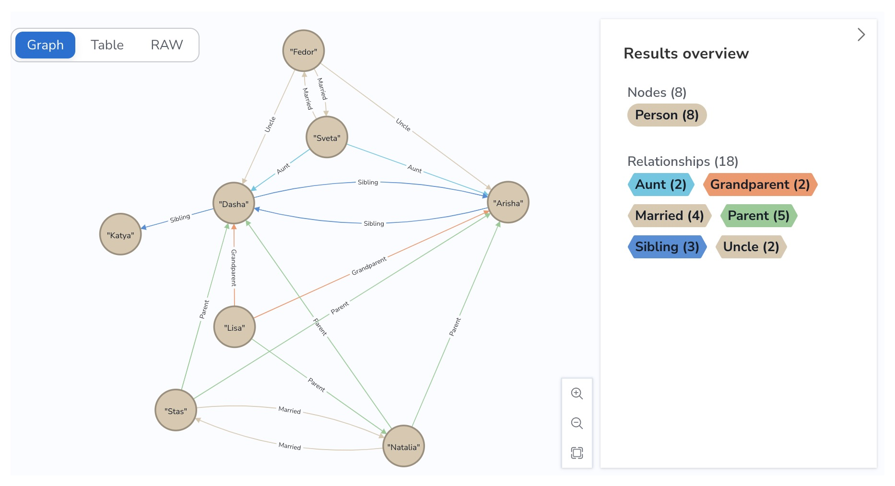

## neo4j

Я делала защиту прям на [сайте](https://neo4j.com/), но можно и локально в докере [поднять](https://github.com/Inspirate789/neo4j-social-graph). Там вроде нужно чуть повозиться чтоб начать строить граф и вообще понять куда писать запросы, но рано или поздно приходит осознание!

Я уже не помню финальный ли это вариант графа или нет, но, наверное, все равно будет полезно оставить это тут:

```
CREATE (dasha:Person {name: "Dasha", sex: "female"}),
(arisha:Person {name: "Arisha", sex: "female"}),
(natalia:Person {name: "Natalia", sex: "female"}),
(stas:Person {name: "Stas", sex: "male"}),
(lisa:Person {name: "Lisa", sex: "female"}),
(ivan:Person {name: "Ivan", sex: "male"}),
(fedor:Person {name: "Fedor", sex: "male"}),
(sveta:Person {name: "Sveta", sex: "male"}),
(katya:Person {name: "Katya", sex: "female"}),

(natalia)-[:Parent]->(dasha),
(natalia)-[:Parent]->(arisha),
(stas)-[:Parent]->(dasha),
(stas)-[:Parent]->(arisha),
(arisha)-[:Sibling]->(dasha),
(dasha)-[:Sibling]->(arisha),
(dasha)-[:Sibling]->(katya),
(stas)-[:Married]->(natalia),
(natalia)-[:Married]->(stas),
(lisa)-[:Parent]->(natalia),
(lisa)-[:Grandparent]->(arisha),
(lisa)-[:Grandparent]->(dasha),
(sveta)-[:Aunt]->(dasha),
(sveta)-[:Aunt]->(arisha),
(fedor)-[:Uncle]->(dasha),
(fedor)-[:Uncle]->(arisha),
(sveta)-[:Married]->(fedor),
(fedor)-[:Married]->(sveta);


Вывести все:
MATCH p=()-[:Grandparent|Married|Parent|Sibling|Uncle|Aunt]->() RETURN p LIMIT 30;


Удалить все:
MATCH (n)
DETACH DELETE n


Запросы!

Найти бабушку Даши:

MATCH (p3:Person)-[:Parent]->(p2:Person)
MATCH (p2:Person)-[:Parent]->(p:Person{name:"Dasha"})
 RETURN p3.name


Найти родителей Даши:
MATCH (p2:Person)-[:Parent]->(p:Person{name:"Dasha"})
 RETURN p2.name


Найти всех моих сестер/братьев:
MATCH (p2:Person)-[:Sibling]->(p:Person)
 where p2.name = "Dasha"
 RETURN p.name
```


